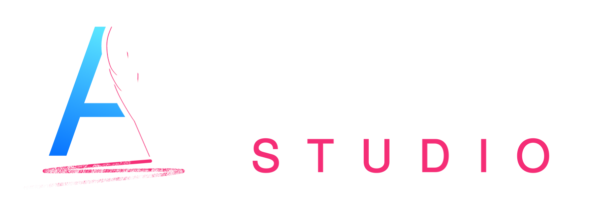

# ⌨️ We are Agora

Agora is an online writing studio, powered by AI. It helps you speed your writing process with the power of LLMs 
(Large Language Models), and focus on creative tasks.

## 👋 The Team

We are 2 graduated engineers in machine learning and economic sciences, from Paris (France). We are passionate about
crafting engaging stories, and worked on some narrative projects before the advent of LLMs.

## 📱 Socials

Join us on social media!

## Documentation

- [Generic information](https://github.com/a-novel/.github)
